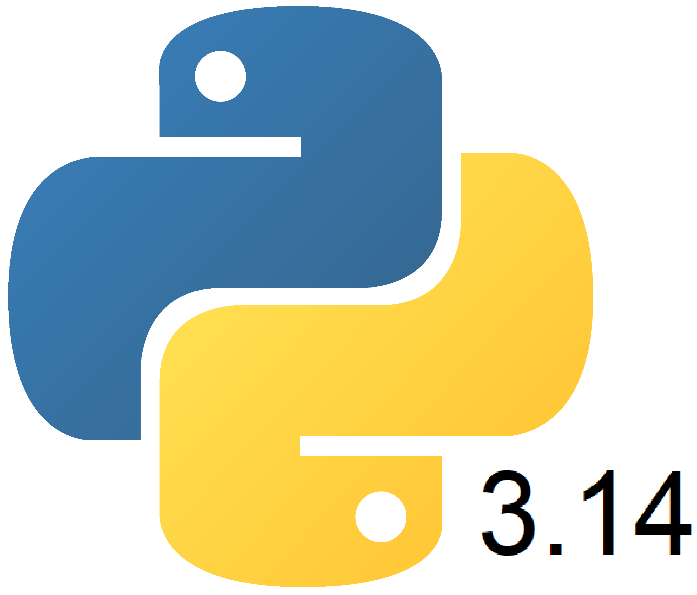

<h1 align="center">ML Assisted Partial Discharge Analysis</h1>

  

<h2>Overview: </h2>
This code repository contains the library installation instructions, source code and alogrithmic explanations related to the author's 'Advancing the Fundamental Understanding of Electrical Tree Initiation Mechanisms using ML Assisted Data Analysis' dissertation project.
Each branch corresponds to a specific area of investigation as intuitive, these include: Autoencoder, Density, Gaussian-Mixture-Modelling, HDBSCAN, Image-Processing, K-means. Within each of these, a separate README file is available with a description of the corresponding program e.g. README_HDBSCAN.
The contents of these README file have been collated in this complete repository README, complete with flowcharts for each program.
<h2>Required Libraries: </h2>
Default Python Libraries:
These libraries come pre-installed with python 3.14 and do not require additional installation.
<ul>
  <li>Glob</li>
  <li>OS</li>
  <li>Time</li>
</ul>
Additional Python Libraries:
These libraries DO NOT come pre-installed with python 3.14 and require additional installation. Instructions for the installation of each library are provided.
<ul>
  <li><a href = https://pandas.pydata.org/docs/getting_started/install.html>PANDAS</a></li>
  <li><a href = https://numpy.org/doc/stable/user/absolute_beginners.html>NumPy</a></li>
  <li><a href = https://matplotlib.org/stable/users/explain/quick_start.html>Matplotlib</a></li>
  <li><a href = https://pytorch.org/>Pytorch</a></li>
  <li><a href = https://pypi.org/project/river/>River</a> - River library is supported up to Python version 3.12.0 and requires prerequisite installations of both Cython and Rust. 
This is because some of the machine learning algorithms available in river require high speed loops or strict memory management.
By implementing these features using Cython or Rust, python interpreter overhead is lost and this speed can be achieved.
</li>
</ul>
<h2>Density Branch: </h2>
This branch contains scripts tailored towards analysing event frequency trends and PD event structure in several domains.
<h3>Time Density: </h3>
Data initialisation:

* select directory
* load directory into files 
* drop NaN rows from df
* optionally filter magnitude ranges
* create global dataframe for density readings

Grouping:
* create dataframe column for rounded phase degrees
* create new dataframe with columns:
>>time_us as the index,  
>>the corresponding count values for each phase group,   
>>the total charge for that group in another,  
>>the count value of only positive magnitude events,  
>>the total charge of positive events,  
>>the count value of only negative magnitude events,  
>>the total charge value of negative events,  

* new dataframe created for plotting with .reset_index() adding a separate column from time_us for the index.
* RMS calculated for all values, only positive values, only negative values calculated
* add file dataframe to plot

Plot:
3 plots, one for all data, one for positive, one for negative  
twin axis plots:  
ax1: density vs. time,  
ax2: RMS PD magnitude vs. time  

<h3>Phase Density: </h3>

Data initialisation:
* select directory
* load directory into files 
* drop NaN rows from df
* optionally filter magnitude ranges
* create global dataframe for density readings

Grouping:
* create dataframe column for rounded phase degrees
* create new dataframe with columns:
>>rounded phase degrees as the index,   
>>the corresponding count values for each phase group,   
>>the total charge for that group in another,  
>>the count value of only positive magnitude events,  
>>the total charge of positive events,  
>>the count value of only negative magnitude events,  
>>the total charge value of negative events,  

* dataframe is then reindexed to include 360 rows
* new dataframe created for plotting with .reset_index() adding a separate column from phase_deg_rounded for the index.
* values added to global dataframe
* global RMS for all values, only positive values, only negative values calculated

Plot:  
3 plots, one for all data, one for positive, one for negative  
twin axis plots:   
ax1: density vs. phase,  
ax2: RMS PD magnitude vs. phase  

<h3>Δt-phase Event Frequency Histogram: </h3> 

Data initialisation:
* create dataframe, read data from csv
* drop NaN rows
* optional filter
* remove negative and zero values for delta t from dataframe

Binning:
* log spaced bins for delta t
* 150 bins between min and max values
* 1 bin per phase degree from 0-360
* 361 bins total

Histogram plot:
* plot of phase_deg vs. d_time_s
* bins specified as above
* PD counts taken as the number of rows that occupy the same bins
* colour gradient is logarithmic
 
<h3>Δt-PRPD heatmap</h3>

Data initialisation:
* read files from directory
* sort files
* determine global min/max delta t values for all files

For each file:
* drop NaN rows
* optional filter
* remove negative and zero values for delta t from dataframe for log compatibility

Scatter Plot:
* x-axis: phase
* y-axis: PD Magnitude
* colour grading: based on Δt, log scale between minimum and maximum values

<h2>K-means Branch: </h2>
This branch contains scripts for single file and multi-file k-means clustering algorithms.

<h3>Single File K-means: </h3>
Data initialisation:
* loads directory as raw string, ignoring '\' conflicts
* reads data from csv using pandas
* removes rows with NaN data in time or charge columns
* converts to numpy 2D array
* scales whole data loaded ~explain scaling algorithm
* optional 2pC filter in charge column for 'noise' or low level microdischarges
* percentage normalisation for charge
 
 
Elbow method:  
The elbow method is a common ML practice for determining the success of 'k' specific grouping in k-means.
Loss is calculated using the kmeans.inertia method, which calculates the sum of the squared distances of each point to its cluster centroid.
This indicates how accurate the grouping is for k groups (closer to centroid = closer group).
However, to remove the risk of overfitting, the ideal k value is determined using the loss score combined with a second difference method.
Thus, the greatest change in loss can be found and this k value can be used. 

	Algorithmically:
		>>k-means performed on data for a range of k values
		>>loss score for each value appended to list
		>>first difference calculated
		>>second differences calculated
		>>ideal k value: index of max second difference value +2
			*+2 added as second index of second difference coincides with k value of 2
		>>plots loss against k for visual inspection

K-means algorithm:  
This program uses the optimised built-in version of k-means for scikitlearn. This is an unsupervised clustering method which uses point geometry to find ideal groupings.
A first pass will randomly assign 'k' centroid locations. The data points will be assigned a centroid based on linear distance. Once all points are assigned a centroid, the
centroid location is recalculated as the centre of the points which belong to it. The groups are then recalculated and the change in the centroid positions are stored at each step.
Once the centroid locations reach a stable point of location change, the algorithm finishes.

This program:
* runs k-means 
* plots time vs. charge with colour groupings and centroids.

<h3>Multi-file K-means: </h3>
#data initialisation
* directory selected by user
* domain selected by user

* loads directory as raw string, ignoring '\' conflicts
* creates list of files in directory using glob
* files are sorted to be read in numerical order
* number of files to be used manually specified

Elbow method updates for streaming application:
* subsection of files selected that is representative of whole data.
* files concatenated to single list
* scaling applied
* elbow inertia method as before.
	>>second difference found using gradient of curve (numpy) for more accurate elbow
* elbow plotted on graph

Chunked k-means algorithm:  
Kmeans algorithm works as above, however, MiniBatchKMeans uses small subsections of whole data (batch size = 10000). Each batch is scaled separately, with a scaling pass being performed first for all files to ensure correct scaling parameters (mean, sd) for the k-means pass.

Scatter plotted file by file. 'cluster' field added to dataframe to assign grouping to data row 
>> {df["cluster"]=kmeans.predict(X)}.

Parameters:  
x-axis >> df["time_s"],      
y-axis >> df["dq_pC"],       
colour >> c=df["cluster"],   
colour map >> cmap="tab10",            
marker-size >> s=1, #smallest = 1
transparency >> alpha=1, #no transparency, most efficient   
rasterization >> rasterized = True, #prevents vector shapes, uses pixels as points for better efficiency  
marker-type >> marker = '.' #smallest marker type, better efficiency  

#legend
* colours added to list from colour map
* handles created using patch geometry, with each colour and a cluster label

<h2>HDBSCAN Branch: </h2>
This branch contains scripts for streamed HDBSCAN and DBSCAN clustering.

<h3>HDBSCAN Library Approach: </h3>
This approach uses the HDBSCAN library.  

Data initialisation:
* select domain
* select input directory and output directory
* check output directory exists
* loads data from input directory folder
* sorts data numerically
* splits data into training sample and test data

Training:
* for each file:
	>> creates dataframe
	>> chooses sample from data
    >> records sample indices for later separation
	>> removes NaN rows
	>> applies scaling to data
	>> adds to data list
* data list is then concatenated
* HDBSCAN performed on sample

HDBSCAN:  
The HDBSCAN algorithm is a density-based clustering algorithm, based upon the preceding 'DBSCAN' algorithm. 

DBSCAN: 
* Observes each data point and the data points which surround it within a user-defined radius (epsilon).  
* Core points are points which meet the minimum quantity of surrounding points within epsilon.
* All core points within epsilon of each other are clustered, each point being used to extend the cluster by epsilon.
* Non-core points within the radius of a core point are added to the cluster, but are not used to further extend it.
* Sparse regions treated as noise.

HDBSCAN:
The HDBSCAN advances upon the DBSCAN by removing the need to specify epsilon. 
Instead, the algorithm essentially tries many values of epsilon to accomodate for regions of high and low density.
As the density requirements change on each pass, the algorithm takes stock of how many clusters merge and finds the optimal clustering solution.

Important Parameters: 
* min_cluster_size >> defines the minimum number of points that are allowed in a cluster.
* min_samples >> defines minimum surrounding points to define a point as dense.
* metric >> defines distance calculation method. This is kept as euclidean.
* core_dist_n_jobs >> allows for user to set number of parallel executions of program. Used to decrease processing time.
* approx_min_span_tree >> HDBSCAN algorithm creates a minimum spanning tree. This method speeds up the algorithm by approximating.
* prediction_data >> this bool allows for the use of prediction data from previous trials. It is needed to train the model before use.

Important Methods:
Scaler Class:  
.fit(data) >> calculates mean and standard deviation for data  
.fit_transform(data) >> calculates mean and standard deviation for data and then scales data accordingly  
.partial_fit(data) >> calculates mean and standard deviation for subsection of data, accumulates for whole data  
.transform(data) >> uses precalculated scaler parameters to standardize data  

HDBSCAN Class:  
.approximate_predict(model, data) >> uses pretrained algorithm model on data to approximate clusters.  
.fit_predict() >> Runs HDBSCAN on data and assigns group for each column.  
 

Using approximate_predict, it is possible to integrate multiple files into the HDBSCAN algorithm and plot the results on the same axis.
This code version uses a for loop to perform approximate cluster predictions for each file within the test data; 
ensuring that test data samples are not shared with training data using saved indices.

Scatter plot:  
x-axis >> df["time_s"],    
y-axis >> df["dq_pC"],    
colour >> c=cluster, #cluster = HDBSCAN assigned clusters  
colour map >> cmap="tab10",         
marker-size >> s=1, #smallest = 1  
transparency >> alpha=1, #no transparency, most efficient  
rasterization >> rasterized = True, #prevents vector shapes, uses pixels as points for better efficiency  
marker-type >> marker = ',' #smallest marker type, better efficiency  

A for loop is used to assertain the colours used for each cluster and assign them to the graphs legend.

Cluster information is separated into multiple files:
		for cluster, group in df.groupby("cluster"): #for each unique cluster, group is the corresponding subsection of dataframe  
		        file_path = os.path.join(output_dir, f"HDBSCAN_cluster_{cluster}.txt") #separate files for each cluster  
		        group.to_csv(  
		            file_path,  
		            mode="a", #append  
		            header=not os.path.exists(file_path), #only write header if first file  
		            index=False  
		        )  

<h3>DenStream Approach: </h3>
This approach uses the DenStream class from the River library.  
Note: DenStream was posed as an alternative to the streaming HDBSCAN used in the final report however it has been omitted from the final report due to poor results / redundancy and excessive load times.

Version: Python 3.12.0

Required libraries:
matplotlib.pyplot: graphical plotting library for python.
pandas: data processing library for python.
glob: file directory library
os: also used for file management
sklearn: contains clustering (k-means) algorithm, scaling algorithms, example datasets.
	>>StandardScalar: scales data using mean and standard deviation to ensure similar feature ranges.
river: python ML library for streaming data into ML algorithms
	>> cluster: contains clustering algorithms. In this program, it is required for DenStream (explained below).

Notes on River library installation:
River library is supported up to Python version 3.12.0 and requires prerequisite installations of both Cython and Rust. 
This is because some of the machine learning algorithms available in river require high speed loops or strict memory management.
By implementing these features using Cython or Rust, python interpreter overhead is lost and this speed can be achieved.

#data initialisation 
* specifies input directory and output directory for cluster information
* creates/validates output directory
* loads files from input directory into list
* sorts file list numerically

#DenStream
'DenStream is a clustering algorithm for evolving data streams. DenStream can discover clusters with arbitrary shape and is robust against noise (outliers).'[1] 
Essentially, DenStream is a density based clustering algorithm that can be used with streaming data to perform a function analagous to DBSCAN clustering. 
It has been implemented to solve memory complications associated with the traditional DBSCAN.
Since it does not require a complete KNN tree of all the data to be loaded into memory, the algorithm can perform clustering on the whole data without requiring massive amounts of memory.

Parameters [1]:
decaying_factor: controls the impact of historical data on current cluster. 
>>0.01 has been chosen to investigate the clusters assuming that previous discharge events have a significant impact on current discharges.
beta / mu: controls the distance threshold from micro cluster centres at which points are considered noise (beta*mu > 1).
>>beta = 0.5, mu = 2.001  have been chosen to minimise noise tolerance to isolate abnormal regions as noise and extract them for further investigation using HDBSCAN.
epsilon: defines the neighbourhood radius for density clustering as in DBSCAN.
>>set at 0.9 to produce several clusters but preventing overfitting at lower epsilon values.
n_samples_init: defines the number of data points used to form the initial microclusters withing the data before streaming begins.
>>1000 is the default value and is usually sufficient (even for large datasets) as streaming means the clusters adapt with more data anyway.

#Streaming and Plotting
For each file in file directory:
* moves data into dataframe, keeps only phase_deg and q_pC columns to reduce bloat
* removes NaN rows
* to extract abnormal regions, filter is applied (df[(df["q_pC"] <= 0) & (df["phase_deg"] <= 180)])
* dataframe is scaled using numpy array, saved into new df_scaled
* df_scaled processed iteratively per row
* for each row, a dictionary is generated using phase and q_pC columns from df_scaled.
* this is so that the .learn_one() and predict_one() methods from the River cluster library can be used to implement the denstream algorithm.
	pass 1:
	>> .learn_one(X) updates the model with a new set of features X [1]
	pass 2:
	>> .predict_one(X) predicts the cluster value for a new set of features X [1]
* cluster IDs are then added to dataframe
* dataframe rows saved to text files based on their cluster value
* new file dataframe rows are appended to existing text files
* dataframe plotted with cluster-based colour grading for each point 

References:
[1] River DenStream. Available at (https://riverml.xyz/0.20.1/api/cluster/DenStream/) (Accessed 11 March 2026). 

